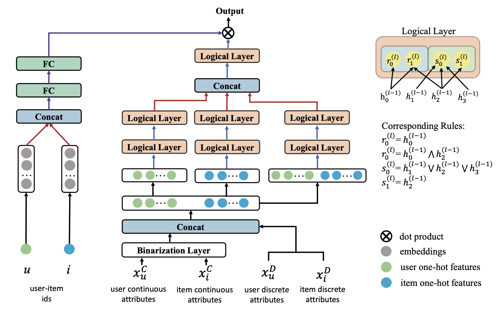

# Neuro-Symbolic Interpretable Collaborative Filtering
The code of WWW 2022 paper "Neuro-Symbolic Interpretable Collaborative Filtering for Attribute-based Recommendation".  

<p align="center">
  
  <br />
  <br />
</p>

This is a `pytorch` implementation of NS-ICF model.

### Prerequisites
- Python 3.7
- Pytorch>=1.4.0

### References
If you find this work helpful in your research, please consider citing the following paper. The bibtex are listed below:

```bibtex
@article{yan2022www,
  title={Neuro-Symbolic Interpretable Collaborative Filtering for Attribute-based Recommendation},
  author={Zhang, Wei and Yan, Junbing and Wang, Zhuo and Wang, Jianyong},
  year={2022}
}
```
